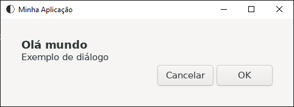
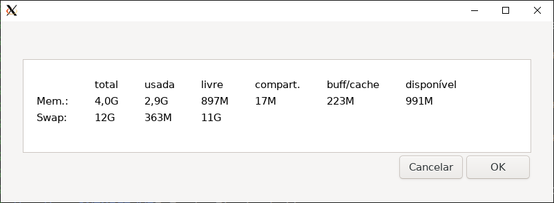
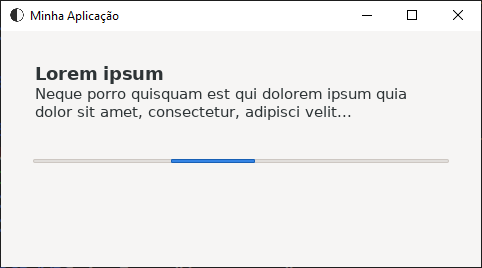
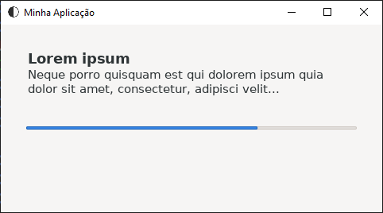
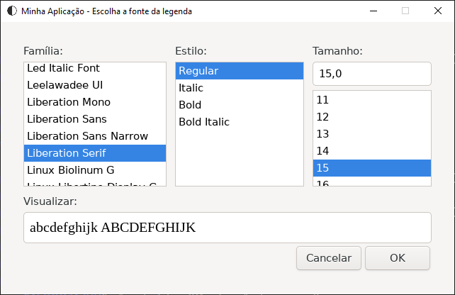
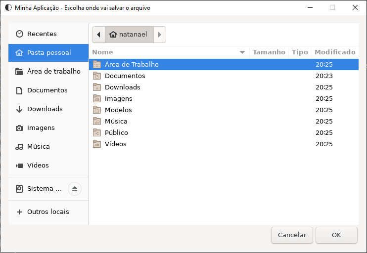
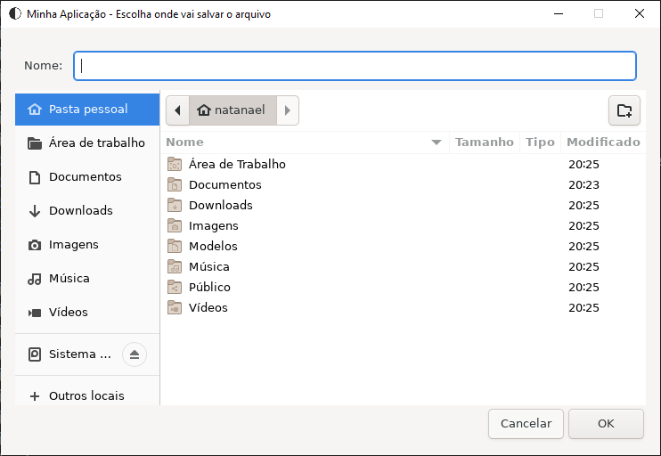
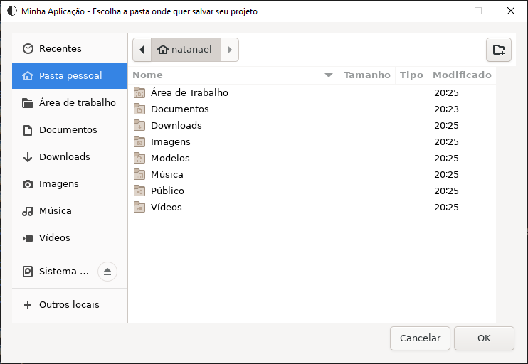

# LovelyGUI
A maneira mais simples e fácil de criar aplicativos GUI para Linux usando shellscript 

A maioria das aplicações utilitárias envolve pegar informações do usuário, processar e exibir ou salvar em disco, e a forma como as informações são captadas tendem a ser basicamente as mesmas porém em layouts diferentes, esse kit trás os principais meios de captação de dados em módulos separados, basicamente tudo que você tem que fazer é pegar os módulos que sua aplicação precisa e pronto, simples assim, você pode focar no processamento dos dados

# Dependências

 - `sed`
 - `cut`
 - `yad`
 
> Note que `sed` e `cut` geralmente vem pré instalados em praticamente todas as distribuições linux

# Configuração inicial

Requer apenas 2 passos:

1. Na pasta de fontes do seu projeto faça o download do LovelyShellGUI:

```bash
wget "https://raw.githubusercontent.com/sudo-give-me-coffee/LovelyShellGUI/main/src/LovelyShellGUI.sh"
```

2. Adicione essa linha no seu projeto:

```bash
. "$(dirname "$(readlink -f "${0}")")"/LovelyShellGUI.sh
```

E pronto, simples assim, o LovelyShellGUI está configurado, o proximo passo é configurar o seu aplicativo

# Configurando o seu aplicativo

Todo o LovelyShellGUI é configurado através de variáveis ambientes, as duas primeiras servem para descrever sua aplicação:

```bash
AppTitle="Minha Aplicação"
AppIcon="icone.svg"
```

Ao chamar a função `show` podemos ver o que essas variáveis fazem:


`AppTitle` define o título da janela e `AppIcon` define o ícone da janela

> Dica: Procure manter essas variáveis ambientes constantes

# Seu primeiro diálogo

> Embora você possa fazer de forma avulsa, o ideal é seguimentar cada diálogo em uma funçã

Uma vez configurado a base da aplicação, podemos investir nos módulos, vamos dar um titulo com a variável `DialogTitle` e uma descrição com a varíavel `DialogDescription` pro nosso diálogo e vamos exibir usando `show`:

```bash
function digaOi() {
  local DialogTitle="Olá mundo"
  local DialogDescription="Exemplo de diálogo"
  
  show
}
```

Então ao chamar a função `digaOi` temos a seguinte tela:



# Trabalhando com entradas do usuário

No exemplo anterior vimos como é simples contruir diálogos, agora vamos ser como é igualmente simples obter a entrada do usuário, para isso nós vamos definir o tipo de dado que queremos obter, para isso definimos a variável `DialogType` com o tipo desejado, por exemplo, podemos definir ela como `input` para pegar uma linha de texto com o nome do usuário:

```bash
function perguntaNome() {
  local DialogTitle="Qual o seu nome?"
  local DialogDescription="Digite seu nome no campo abaixo"
  local DialogType="input"
  
  show
}
```

Então ao chamar a função `perguntaNome` temos a seguinte tela:


Note que a função `show` não devolve o que o usuário digitou, o LovelyShellGUI para impedir que o seu código fique poluído armazena os dados na variável global `DIALOG_OUTPUT`, então para obter a entrada do usuário basta pegar o conteúdo dessa variável, veja o mesmo exemplo, agora iniciando outro diálogo com a entrada do usuário:

```bash
function perguntaNome() {
  local DialogTitle="Qual o seu nome?"
  local DialogDescription="Digite seu nome no campo abaixo"
  local DialogType="input"
  
  show
  
  nome=${DIALOG_OUTPUT}
  
  local DialogTitle="Olá ${nome}, tudo bem?"
  local DialogDescription="Viu como é fácil obter a entrada do usuário usando LovelyShellGUI?"
  unset DialogType
  
  show
}
```

Nesse exemplo a variável `nome` recebe a saída da primeira caixa de diálogo (`${DIALOG_OUTPUT}`)

# Detectando o botão "Cancelar" e "Fechar janela"

O LovelyShellGUI foi pensado para tornar a manutenção do código simples e legível, pensando nisso a função `show` foi desenhada para gerir isso, ela retorna `1` quando o usuário clica em  "Cancelar" ou fecha a janela, sendo assim, basta usar o operador `&&` nela para que a próxima ação só seja executada caso o usuário não cancele a operação: 

```bash
function perguntaNome() {
  local DialogTitle="Qual o seu nome?"
  local DialogDescription="Digite seu nome no campo abaixo"
  local DialogType="input"
  
  show && {
    nome=${DIALOG_OUTPUT}
  
    local DialogTitle="Olá ${nome}, tudo bem?"
    local DialogDescription="Viu como é fácil obter a entrada do usuário usando LovelyShellGUI?"
    unset DialogType
  
    show
  }
}
```

Agora a segunda caixa só será exibida se o usuário não fechar a janela ou clicar em "Cancelar


# Trabalhando com diálogos que possuem mais de um campo

Alguns diálogos possuem mais de um campo, para facilitar o processo coloca o valor de cada campo em linhas separadas, assim basta pegar a linha correspondente ao campo, uma das formas de se fazer isoo é usar `variable=$(sed -n Xp <<< "${DIALOG_OUTPUT}")` onde `variable`é o nome da variável e `X` é o número da linha correspondente ao campo, veja o exemplo:

```bash
function perguntaHora() {
  local DialogTitle="Que horas pro alarme?"
  local DialogDescription="Use o formato 24 horas"
  local DialogType="time"
  
  show && {
    horas=$(sed -n 1p <<< "${DIALOG_OUTPUT}")
    minutos=$(sed -n 2p <<< "${DIALOG_OUTPUT}")
      
    local DialogTitle="Você escolheu ${horas} h e ${minutos} min"
    local DialogDescription="Viu como é fácil obter a entrada do usuário usando LovelyShellGUI?"
    unset DialogType
  
    show
  }
}
```

Consulte na seção "Tipos de diálogo" a documentação de cada diálogo para obter a linha correspondente a cada campo caso se aplique

# Trabalhando com diálogos tipo lista

O LovelyGUIShell possui diálogos tipo lista, tanto de texto puro como imagens, os elementos são colocados em um array chamado `DialogItemList` seguindo um padrão, para cada tipo de diálogo de lista existe um padrão a ser seguido, veja as demonstrações abaixo:

### `list`
```bash
DialogType="list"

# Certifique-se de esvaziar o array antes de adicionar items
DialogItemList=()
DialogItemList+=("Texto do item 1")
DialogItemList+=("Texto do item 2")
```

Nesse exemplo cada entrada no array corresponte a um item da lista, é o tipo mais simples de lista

### `checklist`
```bash
DialogType="checklist"

# Certifique-se de esvaziar o array antes de adicionar items
DialogItemList=()
DialogItemList+=(FALSE "Texto do item 1")
DialogItemList+=(TRUE  "Texto do item 2")
DialogItemList+=(FALSE "Texto do item 3")
```

Essa lista possui dois campos sendo o primeiro uma caixa de marcação e o segundo o texto do item, o valor `TRUE` significa que a caixa estará marcada por padrão e `FALSE` significa que a caixa estará desmarcada, o usuário poderá escolher multiplos elementos

### `radiolist`
```bash
DialogType="radiolist"

# Certifique-se de esvaziar o array antes de adicionar items
DialogItemList=()
DialogItemList+=(FALSE "Texto do item 1")
DialogItemList+=(TRUE  "Texto do item 2")
DialogItemList+=(FALSE "Texto do item 3")
```

A sintaxe é exatamente a mesma do `checklist` a diferença é que o `radiolist` permite que o usuário escolha apenas um item

### `image-list`
```bash
DialogType="image-list"

# Certifique-se de esvaziar o array antes de adicionar items
DialogItemList=()
DialogItemList+=("arquivo1.png" "Texto do item 1")
DialogItemList+=("arquivo2.png" "Texto do item 2")
DialogItemList+=("arquivo3.png" "Texto do item 3")
```

Essa lista também possui dois campos porém o primeiro recebe um nome de um arquivo de imagem e o segundo o texto do item, ela funciona de forma similar ao `list` porém permite especificar uma imagem para o item

### `image-display-list`
```bash
DialogType="image-display-list"

# Certifique-se de esvaziar o array antes de adicionar items
DialogItemList=()
DialogItemList+=("arquivo1.png" "Texto do item 1")
DialogItemList+=("arquivo2.png" "Texto do item 2")
DialogItemList+=("arquivo3.png" "Texto do item 3")
```

Exatamente igual ao `image-list` porém não permite que o usuário selecione nenhum item, servindo apenas para exibição

### `image-checklist`
```bash
DialogType="image-checklist"

# Certifique-se de esvaziar o array antes de adicionar items
DialogItemList=()
DialogItemList+=(FALSE "arquivo1.png" "Texto do item 1")
DialogItemList+=(TRUE  "arquivo2.png" "Texto do item 2")
DialogItemList+=(FALSE "arquivo3.png" "Texto do item 3")
```

Essa lista funciona de forma similar a `checklist` porém possui 3 campos, o primeiro é a caixa de marcação, o segundo o arquivo de imagem e o terceiro o texto do item

### `image-radiolist`
```bash
DialogType="image-radiolist"

# Certifique-se de esvaziar o array antes de adicionar items
DialogItemList=()
DialogItemList+=(FALSE "arquivo1.png" "Texto do item 1")
DialogItemList+=(TRUE  "arquivo2.png" "Texto do item 2")
DialogItemList+=(FALSE "arquivo3.png" "Texto do item 3")
```

Essa lista funciona de forma similar a `radiolist` porém possui 3 campos, o primeiro é a caixa de marcação, o segundo o arquivo de imagem e o terceiro o texto do item

----------------------------------------------------------------------------

### Tratando a saída

A saida das listas podem ser de dois tipos:

#### Para listas do tipo `checklist` e `radiolist`

A variável output retornará todos os itens com os valores da caixa de marcação, a saída se parecerá com isso:

```
FALSE Texto do item 1
TRUE  Texto do item 2
FALSE Texto do item 3
```

Nesse exemplo o usuário marcou o "Texto do item 2" e deixou os campos "Texto do item 1" e "Texto do item 3" desmarcados

#### Para listas simples

A variável output retornará apenas o item selecionado

# Formatando texto em grades

O `LovelyShellGUI` possui uma caixa de dialogo especial para fazer a exibição de linhas de texto, ele funciona como uma lista de exibição porém é possivel definir a quantidade de colunas, permitindo a exibição em forma de grades, por exemplo para criar um diálogo com uma grade de 3 colunas pode se usar:

```bash
DialogType="text-grid"
DialogTextGridColumns=3
```

E por fim basta popular o `DialogItemList`:

```bash
# Certifique-se de esvaziar o array antes de adicionar items
DialogItemList=()
DialogItemList+=("Linha=1,Coluna=1" "Linha=1,Coluna=2" "Linha=1,Coluna=3")
DialogItemList+=("Linha=2,Coluna=1" "Linha=2,Coluna=2" "Linha=2,Coluna=3")
DialogItemList+=("Linha=3,Coluna=1" "Linha=3,Coluna=2" "Linha=3,Coluna=3")
DialogItemList+=("Linha=4,Coluna=1" "Linha=4,Coluna=2" "Linha=4,Coluna=3")
DialogItemList+=("Linha=5,Coluna=1" "Linha=5,Coluna=2" "Linha=5,Coluna=3")
```

Desde que feita as adaptações corretas é possível adaptar a saída de qualquer comando para uma diálogo `text-grid` por exemplo, o exemplo a seguir adapta a saída do comando `free -h --si --kilo` para um diálogo `text-grid`:

```
# Certifique-se de esvaziar o array antes de adicionar items
DialogItemList=()
# Vamos adicionar uma linha em branco para melhorar a estética
DialogItemList+=(" " " " " " " " " " " " " ")

# Adicionamos o cabeçalho
DialogItemList+=($(free -h | sed -n 1p | sed 's/  */   /g'))

# Formatamos a saída do comando `free`
DialogItemList+=($(free -h --si --kilo | sed 's/  */   /g;1d;s/^/ /g'))

```

Ao rodar o comando com `show` a janela a seguir será exibida:



# Exibindo progresso

O `LovelyShellGUI` possui dois diálogos de barras de progresso, cada uma atende um propósito diferente, o uso das duas fazem uso do recurso de pipe com a função show:

```
comando | show
```

Onde `comando` é geralmente uma função que tem uma execução lenta:

### `pulsating-progressbar`

Use esse diálogo para indicar que uma ação sem progressão linear



### `progressbar`

Use esse diálogo para indicar que uma ação que tem progreso, linhas que contém apenas números indicarão o percentual da barra de progresso



Esse é uma simulação de teste da caixa de diálogo:

```bash

DialogType="progressbar"

for i in $(seq 1 10); do
  echo ${i}0
  sleep .3
done | show
```

> Dica: 
> Use a função a seguir para filtrar o `wget`
> ```bash
>function webget(){
>  local regexp="s/.* \([0-9]\+%\)\ \+\([0-9,.]\+.\) \(.*\)/\1/;s/%//" 
>  [ -n "${2}" ] && {
>    wget  "${1}" -O "${2}" 2>&1 | sed -u "${regexp}"
>    return ${?}
>  }
>  wget  "${1}" 2>&1 | sed -u "${regexp}"
>}
>```
>
> Passe a URL como primeiro parametro e opcionalmente o nome do arquivo em segundo:
>
> ```bash
> webget "https://exemplo.com/arquivo.ext" | show
> ```
>
> ```bash
> webget "https://exemplo.com/arquivo.ext" "nome_a_ser_salvo.ext" | show
> ```
> 

# Tipos de diálogo

Os subtítulos a seguir se referem ao valor que devem ser passado para a variável `DialogType`

### `input`

Permite receber um linha de texto do usuário


* Numero de linhas na variável `DIALOG_OUTPUT`: 1

Esse diálogo pode ter o tipo alterado para números atribuindo o valor `number` a variável `DialogInputType`
caso use o tipo númerico você pode definir o valor mínimo com a variável `DialogInputMinNumber` e o valor máximo
com a variável `DialogInputMaxNumber`, note que o número máximo que o campo lê no tipo `number` é 65535

> Dica: A variável `DialogInputInitialValue` define o valor padrão do campo

### `password`

Permite receber um linha de texto do usuário, o usuário não verá os caracteres


* Numero de linhas na variável `DIALOG_OUTPUT`: 1

### `new-password`

Permite receber um linha de texto do usuário, o usuário não verá os caracteres e só conseguirá prosseguir caso os dois campos sejam iguais


* Numero de linhas na variável `DIALOG_OUTPUT`: 1

### `login`

Possui dois campos um `input` e outro `password` na mesma janela


* Numero de linhas na variável `DIALOG_OUTPUT`: 2
* Conteúdo da linha 1: Campo usuário
* Conteúdo da linha 2: Campo senha

### `new-user`

Possui 3 campos um `input` e dois `password` na mesma janela, o usuário só conseguirá prosseguir caso os dois campos `password` sejam iguais


* Numero de linhas na variável `DIALOG_OUTPUT`: 2
* Conteúdo da linha 1: Campo usuário
* Conteúdo da linha 2: Campo senha

### `time`

Possui 2 campos na horizontal do tipo `number`


* Numero de linhas na variável `DIALOG_OUTPUT`: 2
* Conteúdo da linha 1: Campo da esquerda
* Conteúdo da linha 2: Campo da direita

### `text-area`

Possui 1 campo do tipo `input` porém permite mais de uma linha


* Numero de linhas na variável `DIALOG_OUTPUT`: indeterminado

> Nota: todo o conteúdo da variável `DIALOG_OUTPUT` corresponde ao que o usuário digitou no campo

### `scale`

Permite escolher um número entre 0 e 100


* Numero de linhas na variável `DIALOG_OUTPUT`: 1

> Dica: A variável `DialogScaleValue` define o valor padrão do controle

### `font-picker`

Permite escolher uma fonte instalada no sistema, o conteúdo da variàvel `DIALOG_OUTPUT` é um texto no formato `[Nome] [Estilo] [Tamanho]` é diretamente compatível com ImageMagick e CSS



* Numero de linhas na variável `DIALOG_OUTPUT`: 1

> Dica: Nesse diálogo o conteúdo da variável `DIALOG_TITLE` altera o título da janela

### `file-open`

Permite escolher um arquivo no computador



* Numero de linhas na variável `DIALOG_OUTPUT`: 1

> Dica: Nesse diálogo o conteúdo da variável `DIALOG_TITLE` altera o título da janela

### `multiple-file-open`

Exatamente igual ao `file-open` porém permite escolher mais de um arquivo

* Numero de linhas na variável `DIALOG_OUTPUT`: Depende de quantos arquivos o usuário escolher, cada arquivo é colocado em uma linha diferente

### `file-save`

Permite escolher um local e um nome para savar um arquivo, o diálogo não escreve no arquivo, apenas retorna o caminho escolhido



* Numero de linhas na variável `DIALOG_OUTPUT`: 1

> Dica: Nesse diálogo o conteúdo da variável `DIALOG_TITLE` altera o título da janela

### `directory-picker`

Permite escolher uma pasta no computador



* Numero de linhas na variável `DIALOG_OUTPUT`: 1

> Dica: Nesse diálogo o conteúdo da variável `DIALOG_TITLE` altera o título da janela
